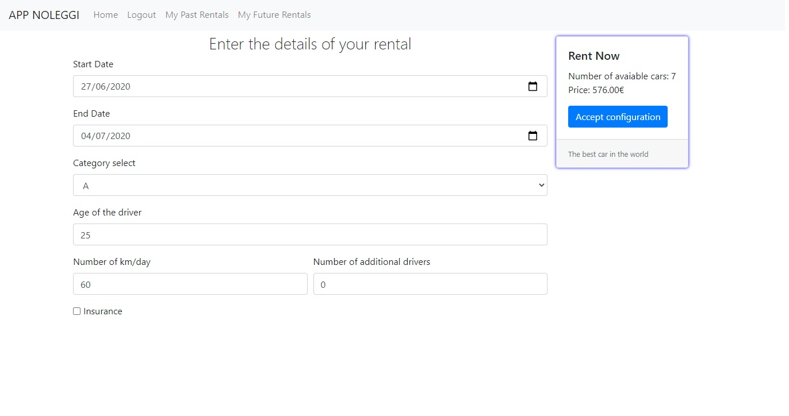

# Exam #1: "Noleggio auto"
## Student: s276390 Mingoia Pier Giorgio 

## React client application routes

- Route `/`: pagina iniziale per utenti non loggati, contiene la lista dei veicoli e i relativi filtri, è presente la Navbar per raggiungere le altre Route.
- Route `/login`: contiene il form che permette all'utente di loggarsi.
- Route `/user`: pagina iniziale dell'utente loggato permette di consultare e modificare la configurazione interattiva.
- Route `/myPastRentals`: pagina accessibile solo agli utenti loggati che permette di visionare i noleggi passati.
- Route `/myFutureRentals`: pagina accessibile solo agli utenti loggati che permette di visionare i noleggi futuri e nel caso di cancellarli.

## REST API server

- POST `/api/login`
  - Nessun parametro e il body della request contiene username e password.
  - la response contiente il cookie e il body è l'userObj che contiene il nome dell'utente
- POST `/api/logout`
  - Nessun parametro e il body della request è vuoto.
  - La response elimina il cookie.
- GET `/api/cars`
  - Nessun parametro e nessun body.
  - Il body della response contiene il JSON di tutti i veicoli presenti nel DB.
- GET `/api/brands`
  - Nessun parametro e nessun body.
  - Il body della response contiene il JSON di tutti i brand distinti presenti nella tabella cars.
- GET `/api/csrf-token`
  - Parametro il csfrToken
  - JSON contentete il csfrToken per farlo avere all'App.
- GET `/api/user/past/rentals`
  - La request contiene il JWT payload e non ha body.
  - La response body contiene la lista dei noleggi passati dell'utente.
- GET `/api/user/future/rentals`
  - La request contiene il JWT payload e non ha body.
  - La response body contiene la lista dei noleggi futuri dell'utente.
- DELETE `/api/rental/:code`
  - Come parametro riceve il codice del noleggio da eliminare, e nessun body.
  - Nessun body per la response.
- POST `/api/avaiableCars`
  - Nessun parametro la request contiene nel suo body i flitri necessari per capire quali vetture sono disponibili.
  - Response body contiene l'avaiableObj che contiene il numero di macchine disponibili, una ipotetica macchina assegnata e se il numero di auto è minore al 10% del totale della categoria.
- POST `/api/rentals`
  - La request contiene il JWT payload e riceve nel body della request la lista di caratteristiche del noleggio.
  - response body contiene un messaggio di successo.
- POST `/api/payment`
  - Il body della request contiene le informazioni della carta di credito.
  - Il body della response contiene un messaggio di succsso.

## Server database

- Table `users` - contiene username e password degli utenti registrati.
- Table `cars` - contiene le macchine con id, brand, modello, categoria.
- Table `rentals` - contiene i noleggi, con relatiivo id, id della macchina e dell'utente, inizio, fine, prezzo, km/d, assicurazione, numero guidatori.
- Table `sqlite_sequence` - contiene la sequenza per l'auto-increment di rentals.

## Main React Components

- `App` (in `App.js`): è il container principale dell'applicazione, contiene il Router dell'applicazione, le funzioni necessarie per effettuare login e logout; Le macchine sono caricate in questa pagina, sono presenti anche le funzioni che gestiscono il cambio di filtro.
- `AppNavbar` (in `Navbar.js`): è la navbar sempre presente, ha due forme una per l'utente loggato e una per quello no. Contiene i Link per raggiungere tutte le pagine disponibili.
- `OptionalErrorMsg` (in `ErrorMsg.js`): Un componente che se è presente un messaggio d'errore lo mostra sotto forma di alert.
- `Login` (in `LoginComponent.js`): contiene il form per effetuare il login e le chiamate alle funzioni di App.
- `CarsShow` (in `Car.js`): Conteine la lista delle carte delle macchine da mostrare e i filtri.
- `InteractiveConfiguration` (in `InConfig.js`): è il configuratore interattivo, contiene il form per il noleggio e per pagare, contiene le funzioni per mostrare il numero di macchine disponibili. Contattando il server con i valori da verificare, si occupa del calcolo del prezzo e di contattare il server per la creazione di un nuovo noleggio.
- `PastRentals` (in `PastRentals.js`): Contiene le carte dei noleggi passati dell'utente.
- `FutureRentals ` (in `FutureRentals.js`): Contiene le carte dei noleggi futuri dell'utente. Con la possibilità di cancellarli comunicando con il server.
- `PaymentForm` (in `CreditCard.js`):form per l'inserimento dei dati della carta di credito e avviare la funzione di pagamento e creazione dell'noleggio.
- `DropdownMultiselect` (in `MultiSelect.js`): versione modificata react-multiselect-dropdown-bootstrap di kfrancikowski, perchè sotto aggiornamento. Contiene le opzioni per i flitri delle macchine, e le relative funzioni per il funzionamento delle select. Funzione pirincipale che controlla il change delle opzioni selezionate.

(only _main_ components, minor ones may be skipped)

## Screenshot

## Test users

* cesare, 1234
* federico, 1234
* mario, 1234 (frequent customer)
* sonia, 1234
* pier, 1234 (frequent customer)
